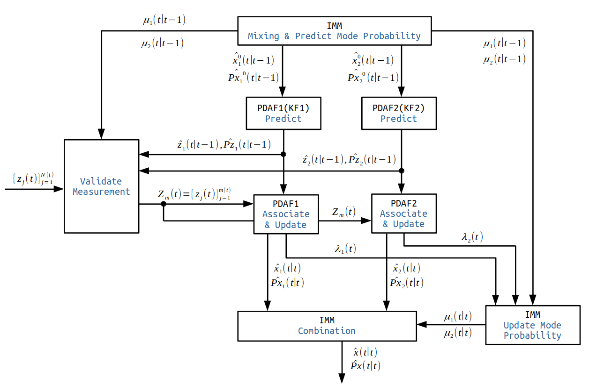
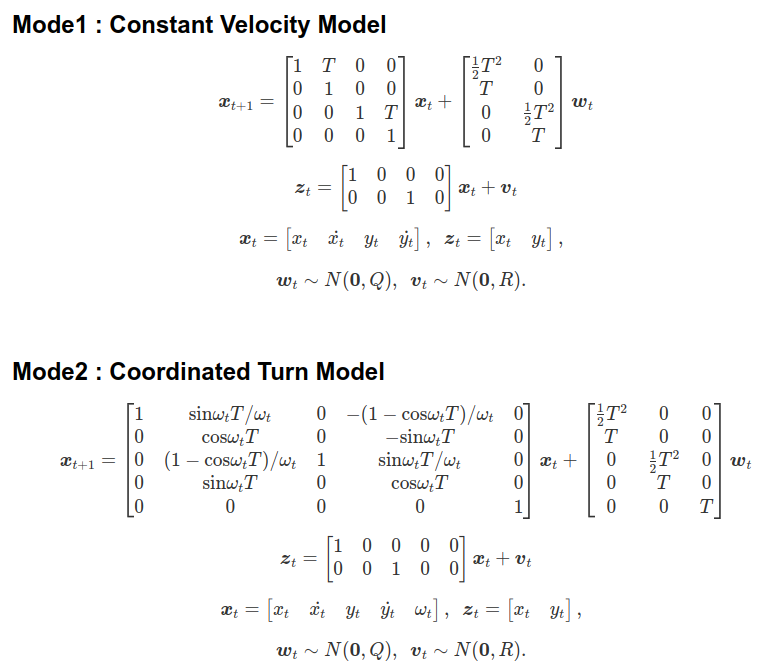
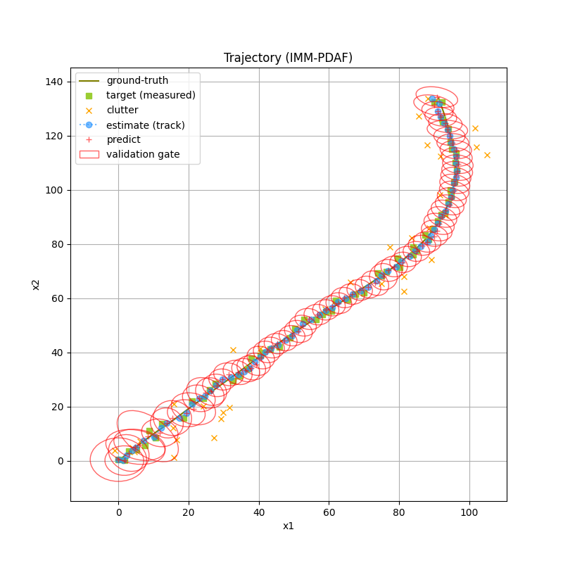
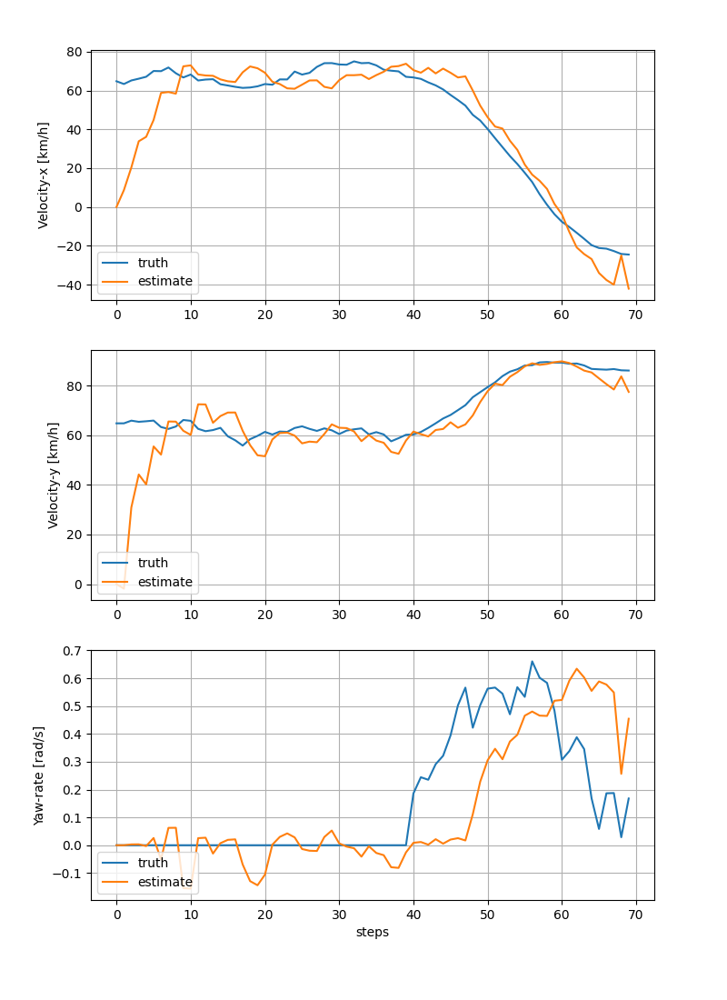

# IMM-PDA Tracker 
An implementation of the IMM-PDA tracker in Python3.

<br>

## Overview of IMM-PDA Tracker




### Measurement Validation
Before associating measurements, the IMM-PDA tracker validates the measurements to exist within an elliptical validation gate. 
Referencing the paper [2], in this implementation, the gate is computed using the weighted sum of mode-conditional predicted measurement distributions, the gaussian mixture, by default. 
Deciding the gate by the predicted distribution with the maximum determinant of the covariance (|Pz|) [1], the tracking result is a bit unstable in this implementation.

### Implemented Kalman filters
The IMM PDA tracker consisits of multiple PDA filters. A PDA filter consists of a Kalman filter and a data association component. The implemented Kalman filters is as fllows.
  * Linear Kalman Filter
  * Extended Kalman Filter
  * Unscented Kalman Filter

<br>

## Model
Implemented target models is as follows [3].



## Installaion
```sh
pip3 install pyyaml numpy scipy matplotlib
```
<br>

## Usage
### &nbsp; Configuration file  
* cfg/sim_imm_pda.yaml : An example of the IMM-PDA tracker.
* cfg/sim_pda.yaml : An example of the PDA tracker.
<br>

### &nbsp; Execute

```sh
python3 main.py --cfg cfg/sim_imm_pda.yaml --output_dir result
```
<br>

The traking result is saved to the specified output directory.


<br>

## References
1. M. Schreier, V. Willert, J. Adamy : "Compact Representation of Dynamic Driving Environments for ADAS by Parametric Free Space Dynamic Object Maps", IEEE Transactions on Intelligent Transportation Systems (2016).

2. Y. Bar-Shalom, T. Kirubarajan, X. Lin : "Probabilistic Data Association Techniques for Target Tracking with Applications to Sonar, Radar and EO Sensors", IEEE Aerospace and Electronic Systems Magazine (2005).

3. Y. Bar-Shalom : "Estimation with Applications to Tracking and Navigation", Wiley-Interscience (1995).
